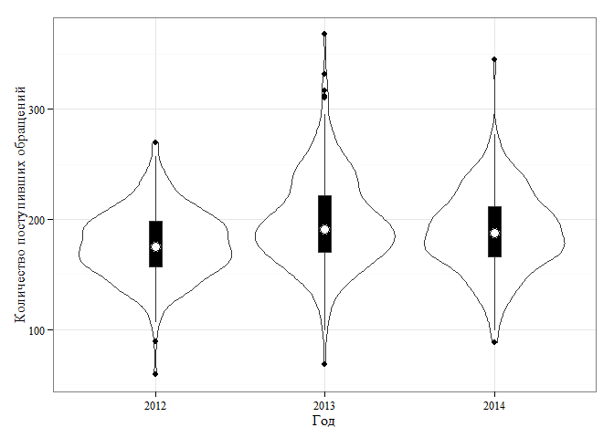

# Контроль процесса разрешения обращений
Тушавин В. А.  
Wednesday, October 15, 2014  

Целью данной работы является анализ загруженности персонала технической поддержки на основании поиска закономерности между входным потоком и числом обращений, находящихся в работе. 

При использовании материалов ссылка на статью в журнале *Тушавин В.А. Использование инструментов менеджмента качества для контроля загрузки ИКТ персонала// Век качества: Связь, сертификация, управление, экономика* обязательна!

Подключаем библиотеки


```r
library(ggplot2)
library("extrafont")
library(kSamples)
library(scales)
loadfonts("win")
```

загружаем исходные данные


```r
SC<-read.csv("datafile.csv",sep=";",dec=".")
dim(SC)
```

```
## [1] 767   4
```

```r
summary(SC)
```

```
##       year           day          SC_in         SC_out   
##  Min.   :2012   Min.   :  1   Min.   :  0   Min.   :  1  
##  1st Qu.:2012   1st Qu.: 86   1st Qu.:155   1st Qu.:159  
##  Median :2013   Median :175   Median :180   Median :180  
##  Mean   :2013   Mean   :174   Mean   :169   Mean   :169  
##  3rd Qu.:2014   3rd Qu.:257   3rd Qu.:204   3rd Qu.:202  
##  Max.   :2014   Max.   :366   Max.   :368   Max.   :351
```

Проведем необходимые преобразования для последующего анализа. Первые две колонки представим факторами, добавим колонку, соответсвующую разнице количеству обращений в работе, зная, что на начало 2012 года в работе было 150 обращений.


```r
SC$year<-as.factor(SC$year)
SC$day<-as.factor(SC$day)
SC$atwork<-SC$SC_in-SC$SC_out+150
summary(SC)
```

```
##    year          day          SC_in         SC_out        atwork   
##  2012:289   3      :  3   Min.   :  0   Min.   :  1   Min.   : 46  
##  2013:267   4      :  3   1st Qu.:155   1st Qu.:159   1st Qu.:137  
##  2014:211   9      :  3   Median :180   Median :180   Median :149  
##             10     :  3   Mean   :169   Mean   :169   Mean   :150  
##             14     :  3   3rd Qu.:204   3rd Qu.:202   3rd Qu.:163  
##             15     :  3   Max.   :368   Max.   :351   Max.   :247  
##             (Other):749
```

```r
head(SC)
```

```
##   year day SC_in SC_out atwork
## 1 2012   1     0      1    149
## 2 2012   2     1      1    150
## 3 2012   3     7      7    150
## 4 2012   4     6      5    151
## 5 2012   5     1      1    150
## 6 2012   6     1      1    150
```

Уберем значения, связанные с работой в выходные дни. Анализ показывает, что число заявок в эти дни не превышает 20.


```r
SC<-subset(SC,SC_in>20)
summary(SC)
```

```
##    year          day          SC_in         SC_out        atwork   
##  2012:249   10     :  3   Min.   : 59   Min.   : 87   Min.   : 46  
##  2013:246   16     :  3   1st Qu.:164   1st Qu.:167   1st Qu.:135  
##  2014:194   17     :  3   Median :185   Median :183   Median :149  
##             23     :  3   Mean   :188   Mean   :188   Mean   :150  
##             24     :  3   3rd Qu.:208   3rd Qu.:205   3rd Qu.:166  
##             30     :  3   Max.   :368   Max.   :351   Max.   :247  
##             (Other):671
```

```r
head(SC)
```

```
##    year day SC_in SC_out atwork
## 8  2012  10   257    169    238
## 9  2012  11   216    217    149
## 10 2012  12   215    170    195
## 11 2012  13   218    219    149
## 14 2012  16   175    215    110
## 15 2012  17   225    205    170
```

```r
dim(SC)
```

```
## [1] 689   5
```


Анализ распределения входящих обращений по годам


```r
p<-ggplot(SC,aes(x=year,y=SC_in))
p+geom_violin()+theme_bw(base_size = 12,base_family ="Times New Roman")+scale_x_discrete(name="Год")+scale_y_continuous(name="Количество поступивших обращений")+geom_boxplot(width=.1,fill="black",outlier.color=NA)+stat_summary(fun.y=median,geom="point",fill="white",shape=21,size=4)
```

 

```r
ggsave("pic1.wmf",width=6, height=4)
```

Рисунок 1 - диаграмма типа "скрипка" для входящих обращений.

******

Виузально распределения 2013 и 2014 года выглядят сходными. Проверим их с помощью непараметрического теста Андерсона-Дарлинга для двух выборок входных потоков.


```r
ad.test(subset(SC,year==2013)$SC_in,subset(SC,year==2014)$SC_in)
```

```
## 
## 
##  Anderson-Darling k-sample test.
## 
## Number of samples:  2
## Sample sizes:  246, 194
## Number of ties: 289
## 
## Mean of  Anderson-Darling  Criterion: 1
## Standard deviation of  Anderson-Darling  Criterion: 0.75809
## 
## T.AD = ( Anderson-Darling  Criterion - mean)/sigma
## 
## Null Hypothesis: All samples come from a common population.
## 
##               AD  T.AD  asympt. P-value
## version 1: 2.259 1.661          0.06615
## version 2: 2.260 1.656          0.06650
```

Как видим по p-значению.0.05, гипотеза о том, что данные выборки были взяты из единой генеральной совокупности не отвергается.

В то же время, 2012 год явно отличается меньшим количеством обращений.


```r
ad.test(subset(SC,year==2012)$SC_in,subset(SC,year==2013)$SC_in)
```

```
## 
## 
##  Anderson-Darling k-sample test.
## 
## Number of samples:  2
## Sample sizes:  249, 246
## Number of ties: 342
## 
## Mean of  Anderson-Darling  Criterion: 1
## Standard deviation of  Anderson-Darling  Criterion: 0.75845
## 
## T.AD = ( Anderson-Darling  Criterion - mean)/sigma
## 
## Null Hypothesis: All samples come from a common population.
## 
##               AD  T.AD  asympt. P-value
## version 1: 16.09 19.89        4.341e-09
## version 2: 16.20 19.99        4.095e-09
```

Построим график зависимости числа обращений в работе от числа входящих обращений


```r
p<-ggplot(SC)
p+geom_point(aes(x=SC_in,y=atwork,fill=year,color=year,shape=year),size=3)+scale_y_continuous(name="Число обращений в работе" )+theme_bw(base_size = 12,base_family ="Times New Roman")+scale_x_continuous(name="Число входящих обращений")+geom_smooth(aes(x=SC_in,y=atwork),method=lm)
```

 

```r
ggsave("pic2.png",width=6, height=4)
```
Построим модель


```r
summary(mdl1<-lm(atwork~SC_in,data=SC))
```

```
## 
## Call:
## lm(formula = atwork ~ SC_in, data = SC)
## 
## Residuals:
##    Min     1Q Median     3Q    Max 
## -90.66 -13.17   0.05  14.74  66.13 
## 
## Coefficients:
##             Estimate Std. Error t value Pr(>|t|)    
## (Intercept)  80.5568     4.1340    19.5   <2e-16 ***
## SC_in         0.3715     0.0216    17.2   <2e-16 ***
## ---
## Signif. codes:  0 '***' 0.001 '**' 0.01 '*' 0.05 '.' 0.1 ' ' 1
## 
## Residual standard error: 21.4 on 687 degrees of freedom
## Multiple R-squared:  0.301,	Adjusted R-squared:   0.3 
## F-statistic:  296 on 1 and 687 DF,  p-value: <2e-16
```

```r
confint(mdl1)
```

```
##               2.5 %  97.5 %
## (Intercept) 72.4400 88.6736
## SC_in        0.3292  0.4139
```

Как видим, регрессия кажется значимой, однако с достаточно большим шумом. 


```r
exp(predict(mdl1,newdata=data.frame(SC_in=c(250,350))))
```

```
##         1         2 
## 2.113e+75 2.888e+91
```


Само число обращений в работе в 2014 году представлено нормальным распределеним, что подтверждается тестом:


```r
SC.y2014<-subset(SC,year==2014)
shapiro.test(SC.y2014$atwork)
```

```
## 
## 	Shapiro-Wilk normality test
## 
## data:  SC.y2014$atwork
## W = 0.9878, p-value = 0.09303
```

```r
dim(SC.y2014)
```

```
## [1] 194   5
```

В таких условиях можно использовать контрольные карты.


```r
library(qcc)
```

```
## Package 'qcc', version 2.5
## Type 'citation("qcc")' for citing this R package in publications.
```

```r
calls_at_work<-SC.y2014$atwork[1:25]
qcc.options(bg.margin="white")
qcc(calls_at_work, type = "xbar.one", plot = TRUE)
```

 

```
## List of 11
##  $ call      : language qcc(data = calls_at_work, type = "xbar.one", plot = TRUE)
##  $ type      : chr "xbar.one"
##  $ data.name : chr "calls_at_work"
##  $ data      : num [1:25, 1] 211 191 184 127 160 146 127 163 174 150 ...
##   ..- attr(*, "dimnames")=List of 2
##  $ statistics: Named num [1:25] 211 191 184 127 160 146 127 163 174 150 ...
##   ..- attr(*, "names")= chr [1:25] "1" "2" "3" "4" ...
##  $ sizes     : int [1:25] 1 1 1 1 1 1 1 1 1 1 ...
##  $ center    : num 156
##  $ std.dev   : num 24.7
##  $ nsigmas   : num 3
##  $ limits    : num [1, 1:2] 81.7 229.8
##   ..- attr(*, "dimnames")=List of 2
##  $ violations:List of 2
##  - attr(*, "class")= chr "qcc"
```


```r
calls_at_work.r <- matrix(cbind(calls_at_work[1:length(calls_at_work)-1], calls_at_work[2:length(calls_at_work)]), ncol=2)
qcc(calls_at_work.r, type="R", plot = TRUE)
```

 

```
## List of 11
##  $ call      : language qcc(data = calls_at_work.r, type = "R", plot = TRUE)
##  $ type      : chr "R"
##  $ data.name : chr "calls_at_work.r"
##  $ data      : num [1:24, 1:2] 211 191 184 127 160 146 127 163 174 150 ...
##   ..- attr(*, "dimnames")=List of 2
##  $ statistics: Named num [1:24] 20 7 57 33 14 19 36 11 24 4 ...
##   ..- attr(*, "names")= chr [1:24] "1" "2" "3" "4" ...
##  $ sizes     : int [1:24] 2 2 2 2 2 2 2 2 2 2 ...
##  $ center    : num 27.8
##  $ std.dev   : num 24.7
##  $ nsigmas   : num 3
##  $ limits    : num [1, 1:2] 0 90.9
##   ..- attr(*, "dimnames")=List of 2
##  $ violations:List of 2
##  - attr(*, "class")= chr "qcc"
```


Информация об используемых пакетах

```r
sessionInfo()
```

```
## R version 3.1.1 (2014-07-10)
## Platform: x86_64-w64-mingw32/x64 (64-bit)
## 
## locale:
## [1] LC_COLLATE=Russian_Russia.1251  LC_CTYPE=Russian_Russia.1251   
## [3] LC_MONETARY=Russian_Russia.1251 LC_NUMERIC=C                   
## [5] LC_TIME=Russian_Russia.1251    
## 
## attached base packages:
## [1] stats     graphics  grDevices utils     datasets  methods   base     
## 
## other attached packages:
## [1] qcc_2.5           scales_0.2.4      kSamples_1.0      SuppDists_1.1-9.1
## [5] extrafont_0.16    ggplot2_1.0.0    
## 
## loaded via a namespace (and not attached):
##  [1] colorspace_1.2-4 digest_0.6.4     evaluate_0.5.5   extrafontdb_1.0 
##  [5] formatR_1.0      grid_3.1.1       gtable_0.1.2     htmltools_0.2.6 
##  [9] knitr_1.6        labeling_0.3     MASS_7.3-35      munsell_0.4.2   
## [13] plyr_1.8.1       proto_0.3-10     Rcpp_0.11.3      reshape2_1.4    
## [17] rmarkdown_0.3.3  Rttf2pt1_1.3.2   stringr_0.6.2    tools_3.1.1     
## [21] yaml_2.1.13
```


